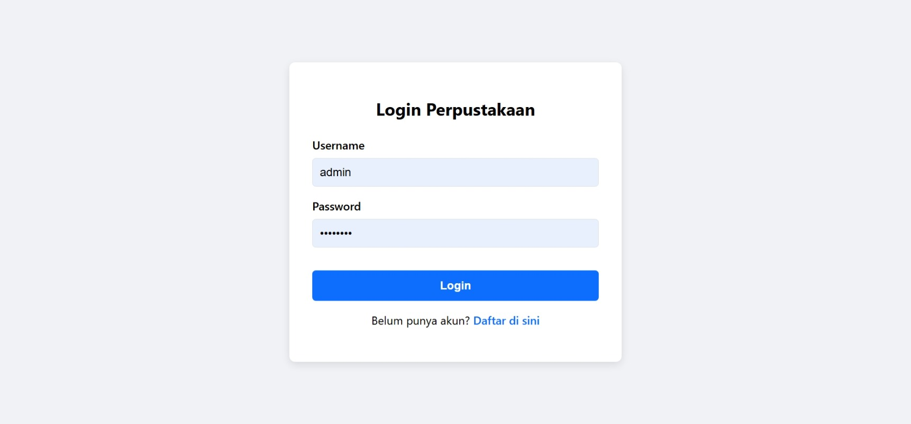
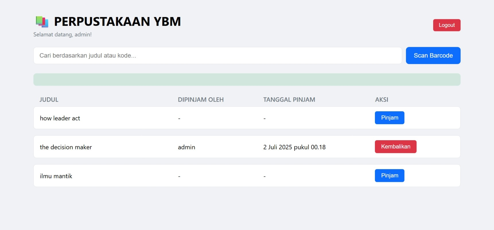

<h1>📚 Sistem Peminjaman Buku PerpustakaanYBM</h1>
 

Sebuah sistem manajemen perpustakaan berbasis web yang dirancang khusus untuk <strong>Asrama Bright Scholarship YBM Brilliant</strong>. Aplikasi ini memodernisasi proses peminjaman dan pengembalian buku melalui antarmuka yang responsif dan integrasi pemindai QR Code.

➡️ Kunjungi Live Demo Aplikasi ⬅️

✨ Fitur Unggulan
Sistem ini dirancang untuk memberikan kemudahan bagi pengelola dan anggota asrama:

✅ Autentikasi Pengguna: Sistem login dan pendaftaran yang aman untuk membedakan antar anggota.

✅ Daftar Buku Real-time: Menampilkan daftar buku beserta status ketersediaan (Tersedia / Dipinjam) yang diperbarui secara langsung.

✅ Pencarian Cepat: Fitur pencarian instan untuk menemukan buku berdasarkan judul atau kode unik.

✅ Pemindai QR/Barcode: Integrasi pemindai menggunakan kamera ponsel untuk mempercepat proses pencarian, peminjaman, dan pengembalian buku.

✅ Antarmuka Responsif: Tampilan yang dapat menyesuaikan diri dengan baik di perangkat desktop maupun mobile.

✅ Aksi Sekali Klik: Tombol "Pinjam" dan "Kembalikan" yang intuitif dan mudah digunakan.

✅ Database Tanpa Server: Menggunakan Google Sheets sebagai backend, menjadikannya solusi yang hemat biaya dan mudah dikelola.

🛠️ Tumpukan Teknologi (Technology Stack)
Aplikasi ini dibangun menggunakan teknologi web modern yang efisien dan mudah diakses:

Frontend:

HTML5: Untuk struktur konten halaman.

CSS3: Untuk styling dan desain antarmuka yang responsif.

Vanilla JavaScript: Untuk logika aplikasi, interaksi pengguna, dan komunikasi dengan backend.

Backend (Database):

Google Sheets: Berfungsi sebagai database untuk menyimpan data buku dan informasi pengguna.

Google Apps Script: Bertindak sebagai API untuk menjembatani komunikasi antara frontend dan Google Sheets.

Pustaka Eksternal:

html5-qrcode: Pustaka JavaScript untuk fungsionalitas pemindaian QR Code dan barcode melalui browser.

🖼️ Tampilan Aplikasi

<b>Klik untuk melihat pratinjau antarmuka</b>

 
<h4>Halaman Login & Pendaftaran</h4>

<h4>Halaman Utama Aplikasi</h4>

🚀 Instalasi & Menjalankan Secara Lokal
Karena aplikasi ini bersifat client-side murni (tanpa memerlukan server Node.js), Anda bisa menjalankannya dengan sangat mudah.

1. Clone Repositori

git clone https://github.com/15-188-taufik/PerpustakaanYBM.git

2. Navigasi ke Direktori Proyek

cd PerpustakaanYBM

3. Buka File HTML

Cukup buka file index.html langsung di peramban web pilihan Anda (seperti Google Chrome atau Firefox).

Catatan Penting: Fungsionalitas penuh (meminjam, mengembalikan, login) bergantung pada API Google Apps Script yang telah dikonfigurasi. Jika Anda melakukan fork pada proyek ini, Anda perlu membuat dan mengkonfigurasi backend Google Sheets dan Apps Script Anda sendiri.

👤 Dikembangkan Oleh
Taufik Hidayat NST

